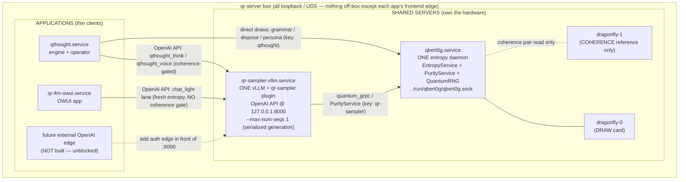

# qr-server Profile — the shared, self-contained box

This is the **box-level "self-containment" deployment**: the one profile that
turns the qr-server machine into **two shared servers** that every application
calls as a thin client. It replaces the old per-app layout (each app shipped its
*own* vLLM unit and its *own* Qbert0G unit) with:

- **`qbert0g.service`** — ONE entropy daemon, sole owner of both Dragonfly cards.
- **`qr-sampler-vllm.service`** — ONE vLLM + qr-sampler engine, the OpenAI API.

`qthought`, `qr-llm-owui`, and any future external caller keep only their own app
unit (+ their own cloudflared frontend) and address these two shared endpoints on
loopback / UDS. Nothing here is exposed off-box; the only public hops are each
app's own frontend edge.

## Topology



**One-line summary:** the two `*-vllm` units collapse into one
`qr-sampler-vllm.service`; the two `*-qbert0g` units collapse into one
`qbert0g.service`; both apps become clients addressed at the shared loopback
endpoints.

## Files in this profile

| File | Role |
|---|---|
| `qbert0g.service` | The shared entropy daemon unit (both cards, one socket). |
| `qbert0g.config.yaml.example` | The shared daemon config. **Byte-identical** to `Qbert0G/deployments/qr-server/qbert0g.config.yaml.example` — edit both together. |
| `qr-sampler-vllm.service` | The shared vLLM + qr-sampler engine unit. |
| `qr-server.env.example` | Environment for the shared vLLM (model path + entropy transport + the `qr-sampler` key). |
| `README.md` | This file. |

The two apps supply their own `*.service` + `.env` (with their own qbert0g key
and per-lane `qr_preset` default) from their own repos — they are not part of
this profile.

## Install

```bash
# 1) Shared entropy daemon
sudo cp qbert0g.service /etc/systemd/system/
sudo install -D -m 600 qbert0g.config.yaml.example /etc/qbert0g/qbert0g.config.yaml
sudo nano /etc/qbert0g/qbert0g.config.yaml     # set auth.api_key + device paths/fingerprints
sudo systemctl daemon-reload && sudo systemctl enable --now qbert0g

# 2) Provision the three dragonfly-0 keys (see below), then paste each into the
#    consuming process's env/config.

# 3) Shared vLLM engine
sudo cp qr-sampler-vllm.service /etc/systemd/system/
sudo install -D -m 600 qr-server.env.example /etc/qr-server/qr-server.env
sudo nano /etc/qr-server/qr-server.env         # SHARED_MODEL_PATH + QR_GRPC_API_KEY (qr-sampler key)
sudo systemctl daemon-reload && sudo systemctl enable --now qr-sampler-vllm
```

## Freshness & never-reused — one draw card, one lock

Every draw on the box — the shared vLLM's per-token sampler, qthought's broker,
owui, any external client — funnels through **`dragonfly-0`** behind this one
daemon. Each read takes Qbert0G's per-device lock, flushes the serial RX buffer
(`freshness.flush_device_buffer: true`), measures fresh, stamps
`generation_timestamp_ns`, and serves exclusively (`allow_pooling: false`,
`allow_pregeneration: false` — the daemon refuses to boot otherwise). Because
there is a **single** draw card behind a **single** lock, no measured byte can be
served twice under any interleaving of clients. This is structural, not
disciplinary. (Exercised directly by Qbert0G's concurrency harness against a mock
device.)

`dragonfly-1` never serves a byte: it appears only in `coherence.pair` and is read
solely by the background coherence monitor.

## Running-batch size — `--max-num-seqs` (`$SHARED_MAX_NUM_SEQS`, default 4)

`qr-sampler-vllm.service` sizes vLLM's running batch from `$SHARED_MAX_NUM_SEQS`
(profile `.env`, **default 4** for quantum serving). Concurrency here is bounded
by the *entropy*, not the GPUs: every generated token draws once from the single
quantum draw card (`dragonfly-0`), so a handful of concurrent sequences is the
sweet spot — they overlap prefill/compute while their per-token device reads
serialize on the card's lock.

- **Correctness at >1:** the per-draw freshness flush is preserved and
  independent draws never corrupt across sequences (on top of the device-level
  guarantee above). Daemon-side draw failover is **disabled**
  (`server.failover_enabled=false`), so a momentarily busy `dragonfly-0` makes a
  draw *wait* for the card rather than mis-route to the coherence-only
  `dragonfly-1` (which has no draw fingerprint). This is why >1 became safe — a
  hard-pinned `1` was previously used to sidestep that mis-routing.
- **Fairness:** qthought's always-on loop awaits each of its own turns before
  issuing the next, so an owui or external request waits at most a few in-flight
  sequences before it runs. Neither side locks the other out.
- **PRNG "bypass" mode:** raise `SHARED_MAX_NUM_SEQS` to a large value (e.g. 16)
  **only** when running this engine on a system/PRNG entropy source (no quantum
  draws) — e.g. for PRNG LLM research alongside the quantum services. With no
  draw card to contend for, a big running batch is pure throughput. Do **not**
  run 16 against the quantum draw card: the extra sequences just queue on the
  card lock and add latency.

## `QR_PREINIT_ENTROPY_SOURCES`

The vLLM adapter pre-initialises one entropy pipeline per source named in
`QR_PREINIT_ENTROPY_SOURCES` (default `quantum_grpc,system`). This env var **must
list every source any lane can select** per-request via `qr_entropy_source_type` —
an un-preinitialised value is rejected cleanly. Keep `system` in the list: it is
the labelled `os.urandom` fallback leg and it enables a quantum-vs-PRNG comparison
request without a restart.

**Named instances:** `QR_ENTROPY_SOURCE_INSTANCES` (JSON) declares named
instances of a source type with per-instance infrastructure overrides — the
qr-server profile ships `qbert_prng_uniform` and `qbert_prng_markov`, both
`quantum_grpc` pipelines whose API keys are bound to the daemon's seeded PRNG
control sources (see key provisioning below). Declared instances are always
pre-initialised (union with the list above) and are selected per-request via
`qr_entropy_source_type: "<instance name>"`; the instance name is carried
end-to-end in diagnostics, so a PRNG lane is loudly labelled, never laundered.

## Per-request lanes (no new server, no contract bump)

Each caller fully determines its own quantum behaviour per-request through the
existing `vllm_xargs` (`qr_*`) → `SamplingParams.extra_args` → `resolve_config`
seam. The current lanes:

| Caller | `qr_preset` | Coherence gate | Notes |
|---|---|---|---|
| qthought THINK | `qthought_think` | yes | truncated (tool call must parse) |
| qthought SPEAK | `qthought_voice` | yes | free distribution |
| owui / external | `chat_light` | **no** | fresh quantum entropy, plain fixed T |

`chat_light` is the lighter lane added for owui and any future external caller:
fresh quantum entropy into the sampler with **no** coherence gate. It is
referenced by the plain `qr_preset` string, so it does **not** cross `contract.py`
and needs no `CONTRACT_VERSION` bump.

## Provisioning keys — draw keys on `dragonfly-0`, study keys on the controls

One daemon. The three original API keys are **all bound to the draw card**;
the two PRNG study keys are bound to the seeded control sources. All created
with `qbert0g keys create`:

```bash
# 1) The shared vLLM (PurityService draws account their whole integration
#    block against the key: the presets request 100 KiB per token since the
#    2026-07 tranche, deferred draws use integration.block_bytes — the 2 MiB
#    max-bytes covers both).
qbert0g keys create --name qr-sampler --device dragonfly-0 --max-bytes 2097152

# 2) qthought's broker (grammar-decode / dispose-gate / persona-seed draws).
qbert0g keys create --name qthought   --device dragonfly-0

# 3) (future) an external caller — provisioned later; nothing else changes.
qbert0g keys create --name external   --device dragonfly-0 --max-bytes 2097152

# 4+5) PRNG-vs-QRNG study lanes (qr-llm-research) — each bound to a seeded
#      control source declared in qbert0g.config.yaml (`controls:`), NOT to a
#      card. Draws through them produce `kind: "prng"` provenance records.
qbert0g keys create --name qr-sampler-prng-uniform --device prng_uniform
qbert0g keys create --name qr-sampler-prng-markov  --device prng_markov
```

Paste each created key into its consuming process:
`qr-sampler` → `QR_GRPC_API_KEY` in this profile's `qr-server.env`;
`qthought` → `QR_GRPC_API_KEY` in qthought's own env;
the two study keys → the matching `grpc_api_key` values inside
`QR_ENTROPY_SOURCE_INSTANCES` in this profile's `qr-server.env`
(`qbert_prng_uniform` / `qbert_prng_markov` instances).

**No key binds draws to `dragonfly-1`.** That card is the coherence reference
only.

### `prng_markov` prerequisite — fit the model first (operator step)

The `prng_markov` control needs an order-1 byte Markov model fitted to
dragonfly-0's byte statistics **before the daemon starts** (config parsing
alone does not require the file; startup validation does):

```bash
# In the Qbert0G repo, from raw dragonfly-0 dumps:
python scripts/fit_markov.py --device-id dragonfly-0 \
    --out /etc/qthought/models/dragonfly-0_markov_v1.npz dump1.bin [dump2.bin ...]
```

The script prints a model-vs-dumps fingerprint summary (byte mean, per-bit
P(1), lag-1 correlation) — eyeball it before use. Until the npz exists, either
comment out the `prng_markov` control (and skip its key) or keep the daemon on
the previous config; the `qbert_prng_markov` vLLM instance then simply rejects
cleanly per-request.

### `provenance.strict: true` — recommended for study runs

For PRNG-vs-QRNG study sessions, flip `provenance.strict: true` in
`qbert0g.config.yaml` so a provenance write failure **fails the draw** instead
of logging-and-serving — a study arm must never contain unattributable bytes.
Ship-state is `false` (availability over auditability for day-to-day serving).

## `GET /health/entropy` — the passive health route

The shared unit wires `--middleware
qr_sampler.engines.vllm.health.entropy_health_middleware` (note the
`module.callable` argv form — a `module:callable` typo crashes only after
minutes of engine init), restoring the health route a bare `vllm serve`
lacks. It is **passive**: it answers from the cross-process status files
described below in O(one file read) and never opens a gRPC channel to the
QRNG, so health polling adds zero entropy-daemon load. Consumers: the OWUI
setup guard (`rpc_ok`/`tcp_ok`/`summary`), the `/api/qr-status` chip, and the
comparison Pipe's no-silent-PRNG banner (`fallback_count` +
`sampler.currently_degraded`/`age_s`). A 404 from this path means the flag or
the installed qr-sampler is missing — probes then fail *open* ("unknown": no
false banner, but no banner on a real degrade either).

## Honest degradation — the cross-process status file

Fallback labelling stays a property of each entropy-consuming process, surfaced
through one shared file:

- Inside the shared vLLM, qr-sampler's `FallbackEntropySource` flips to a
  labelled `system` leg on Qbert0G loss, sets `entropy_is_fallback` on the
  `DrawMeta`, and publishes to the cross-process status file
  (`QR_ENTROPY_STATUS_FILE`, `/tmp/qr_entropy_status.json` by default).
- owui's `qr_status.py` and qthought's public `entropy` event both **read** that
  same file and report the honest signal without touching the QRNG.
- qthought's broker additionally mirrors degraded↔recovered on its own `entropy`
  event for its direct (non-vLLM) draws.

Because Qbert0G loss is global to the box, one shared vLLM writing one status file
that reports "degraded" for all callers is correct, not a regression.

> **Known limitation (best-effort visibility).** One vLLM process writes one
> status file; under serialized generation it reflects the *last-run* sequence, so
> qthought's gate badge can momentarily reflect an owui (gate-closed) turn. This is
> cosmetic and fail-safe (qthought treats a >30 s-stale snapshot as gate-closed).
> The coherence gate's actual per-request sampling effect is applied correctly
> inside vLLM regardless of the file.

## Fallback mode is per-server (documented gap)

`QR_FALLBACK_MODE` is an infrastructure field pinned in `qr-server.env` (`system`,
the labelled `os.urandom` leg). It is **rejected in per-request `extra_args` by
design** — a caller must not be able to disable the honest fallback or force
`mock`. This is the one `qr_*`-family parameter that is deliberately not
per-request; the honest-degradation guarantee is strengthened, not weakened, by
keeping it server-side.

## External path — unblocked, no re-architecture

Exposing the LLM externally later needs **no** server or app changes. The
inference server is already a standalone OpenAI-compatible endpoint on
`127.0.0.1:8000` and the entropy daemon is already a standalone keyed server. To
go public you add, *in front of the existing endpoint only*:

1. **An authenticated edge** — a cloudflared tunnel + an auth/rate-limit shim (or
   a thin BFF) that terminates public traffic and forwards to `:8000`. Do **not**
   change `--host` on the vLLM unit.
2. **An external caller** that sends the lighter `chat_light` `qr_preset` in
   `extra_args`, exactly as owui does.
3. **A dedicated Qbert0G key** bound to `dragonfly-0` (the `external` key above).

The two shared servers, the single draw card, and the serialized generation path
are untouched — the external caller is just one more FCFS client of the same
queue.
